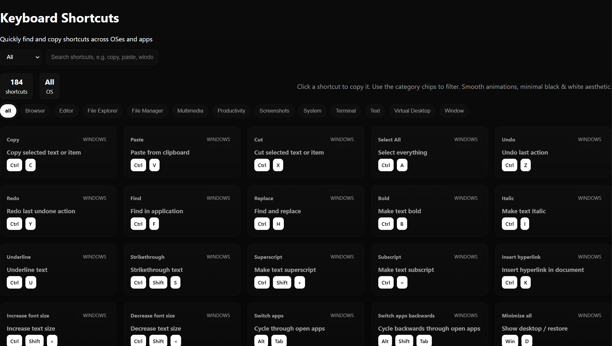
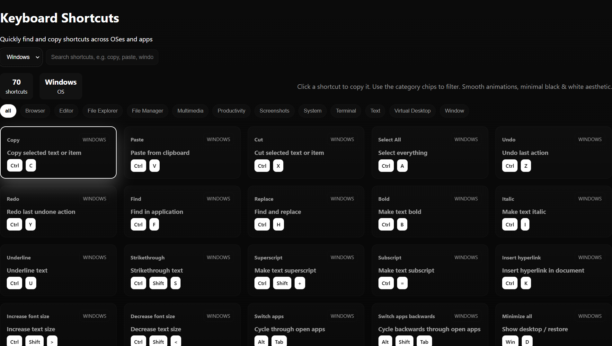
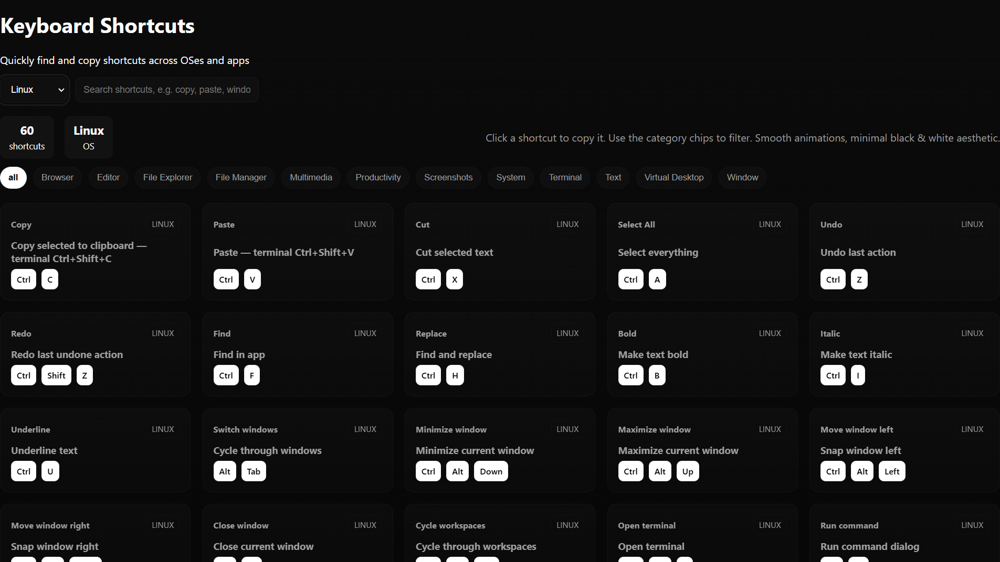
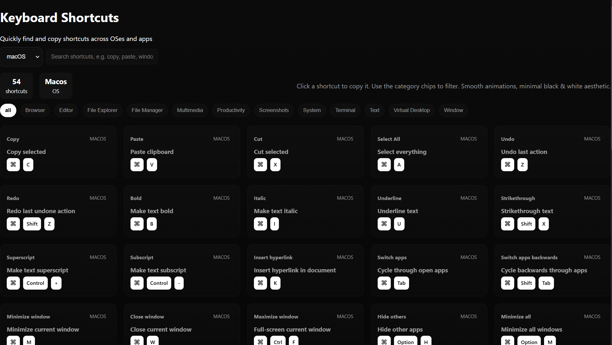

<!-- Banner -->


<p align="center">
  
</p>

<p align="center">
  <a href="https://bismay-exe.github.io/Keyboard-Shortcuts/">
    
  </a>
  
  
  
  
  
</p>

---

## 📸 Preview

<p align="center">
  <table>
    <tr>
      <td align="center">
        <br>
        <b>Keyboard Shortcuts</b>
      </td>
      <td align="center">
        <br>
        <b>Windows Shortcuts</b>
      </td>
    </tr>
    <tr>
      <td align="center">
        <br>
        <b>Linux Shortcuts</b>
      </td>
      <td align="center">
        <br>
        <b>MacOS Shortcuts</b>
      </td>
    </tr>
  </table>
</p>

A **minimal, glassy UI web app** that lets you explore **500+ keyboard shortcuts** for  
**Windows, Linux, and macOS** — searchable, filterable, and copyable with a click.

---

## ✅ Features at a Glance

<div align="center">

### 🔍 Smart Search  
Search shortcuts instantly by keyword (e.g. “copy”, “window”, “screenshot”).

---

### 🖥️ OS Filtering  
Switch between **Windows · Linux · macOS** or view all at once.

---

### 🗂️ Category Chips  
Filter by categories like **Text · Window · Browser · Editor · System**.

---

### 📋 Click-to-Copy  
Click any card to copy the shortcut combo to your clipboard.

---

### 🎨 Smooth UI/UX  
Dark glassmorphism theme  
Responsive grid layout  
Subtle animations & bounce effect

</div>

---

## ⚙️ About Keyboard Shortcuts Explorer

<p align="center">
  <a href="https://bismay-exe.github.io/Keyboard-Shortcuts/">
    
  </a>
</p>

<p align="center">
  <b>⚡ Keyboard Shortcuts Explorer</b><br>
  A fast and elegant way to **learn, search, and copy** productivity shortcuts across OSes.
</p>

---

## 💡 Tips & Tricks

- Use the **OS dropdown** to switch context.  
- Click a **chip** to filter categories.  
- Hit **Enter/Space** on a card for accessibility copy.  
- Works smoothly on **mobile & desktop**.  

---

## 🛠️ Tech Stack  

<p align="center">
  
</p>

---

## 📊 GitHub Stats (Project)

<p align="center">
  
</p>

---

## ASCII Banner

<!--ascii-start-->
Font: `block`
Message: `Shortcuts ⚡`
```text
 ____  __.            ___.                          .___        
|    |/ _|____ ___.__.\_ |__   _________ _______  __| _/        
|      <_/ __ <   |  | | __ \ /  _ \__  \\_  __ \/ __ |         
|    |  \  ___/\___  | | \_\ (  <_> ) __ \|  | \/ /_/ |         
|____|__ \___  > ____| |___  /\____(____  /__|  \____ |         
        \/   \/\/          \/           \/           \/         
  _________.__                   __                 __          
 /   _____/|  |__   ____________/  |_  ____  __ ___/  |_  ______
 \_____  \ |  |  \ /  _ \_  __ \   __\/ ___\|  |  \   __\/  ___/
 /        \|   Y  (  <_> )  | \/|  | \  \___|  |  /|  |  \___ \ 
/_______  /|___|  /\____/|__|   |__|  \___  >____/ |__| /____  >
        \/      \/                        \/                 \/ 
```
<!--ascii-end-->

---

## 🌐 Connect with me

<p align="center">
  <a href="https://github.com/Bismay-exe" target="_blank">
    
  </a>

  <a href="https://instagram.com/bismay.exe" target="_blank">
    
  </a>

  <a href="https://t.me/bismay_exe" target="_blank">
    
  </a>

  <a href="https://discord.com" target="_blank">
    
  </a>
</p>

<p align="center">
  <a href="https://youtube.com" target="_blank">
    
  </a>

  <a href="https://linkedin.com" target="_blank">
    
  </a>

  <a href="https://threads.net/@bismay.exe" target="_blank">
    
  </a>

  <a href="https://t.me/BismaysInventory" target="_blank">
    
  </a>
</p>
